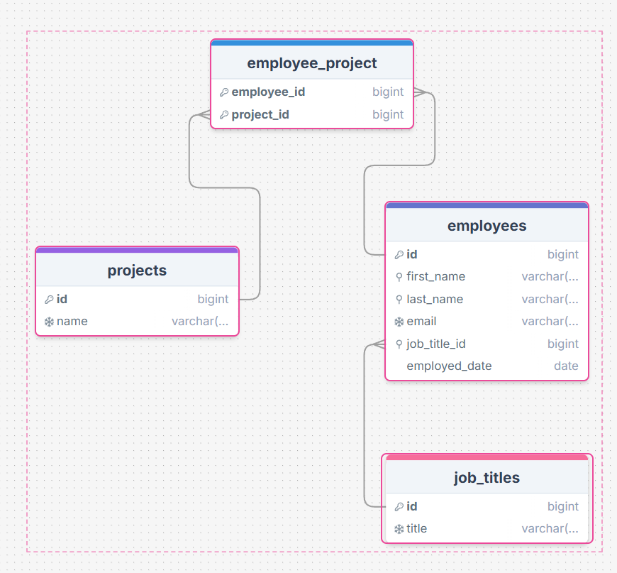
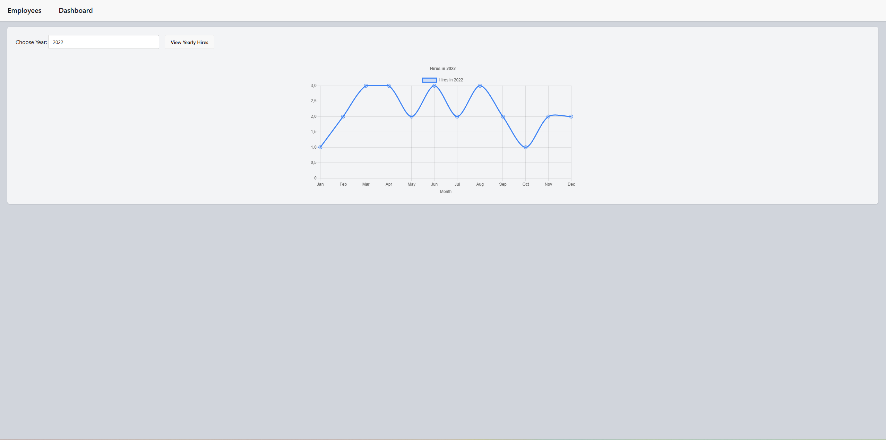

# employee-dashboard

A simple full-stack application for displaying an employee dashboard, built with Spring Boot and Vue.

## Frameworks and Libraries

This project was built with the following main technologies.

### Frontend

- [Vue](https://vuejs.org/) - Javascript framework for building UIs.
- [Vite](https://vitejs.dev/) - Fast build tool and dev server for modern web apps.
- [Tailwind CSS](https://tailwindcss.com/) CSS framework.
- [DaisyUI](https://daisyui.com/) - Tailwind CSS plugin that provides UI components.
- [Chart.js](https://www.chartjs.org/) Simple yet flexible JavaScript charting library.

### Backend

- [Java 21](https://www.oracle.com/java/technologies/downloads/) Latest LTS Java version.
- [Spring Boot](https://spring.io/projects/spring-boot) - Framework for building production-ready Spring applications. This project is built with Spring Boot 4.0.
- [MapStruct](https://mapstruct.org/) - Generates type-safe mappers between Java objects at compile time.
- [Flyway](https://flywaydb.org/) - Database migration and versioning tool.
- [Spring Security](https://spring.io/projects/spring-security) - CORS handling.

### Database

- [MySQL](https://www.mysql.com/) with the following schema:

### Authentication/Authorization

- Not implemented yet.

### Documentation

- [Swagger](https://swagger.io/) - For API documentation. Once the project is running, the swagger documentation can
  be accessed here: Open [http://localhost:8080/swagger-ui/index.html](http://localhost:8080/swagger-ui/index.html).

### Hosting and Deployment

- [Docker](https://www.docker.com/)

## Prerequisites

- A newer version of [Java](https://www.oracle.com/java/technologies/downloads/) installed. This project was built specifically with Java 21.
- Docker installed on your local machine. You can follow Docker's tutorial for [macOS](https://docs.docker.com/desktop/install/mac-install/) or [Windows](https://docs.docker.com/desktop/install/windows-install/).
- The Docker-Compose plugin installed on your machine. You can find download instructions [here](https://docs.docker.com/compose/install/).

## Getting Started

First, from the root folder, go to the backend directory.

```bash
cd backend/employee-dashboard-api/
```

Then, build the Spring Boot project.

On Windows type:

```bash
./mvnw.cmd clean package
```

On Linux type:

```bash
./mvnw clean install
```

Lastly, after the jar file has been created. Go back to the root level of the project and build it with the docker compose file.

```bash
cd ../..
```

```bash
docker compose up --build
```

Open [http://localhost:3000](http://localhost:3000) with your browser to see the result.

**Important note:** Sometimes the frontend container is ready before the MySQL database have initialized fully. This means that one might have to refresh the page after a few seconds to fetch the employees.

## Documentation

### MySQL schema:



### Usage

For the sake of simplicity, best practices for handling secrets and environment variables have been intentionally omitted from this project.

The project currently runs on the following ports:

- Frontend: 3000
- Backend: 8080
- MySQL: 3306

These ports can be modified by updating the port mappings in the root-level `docker-compose` file.

#### The following endpoints are accessible:


**Note:** More detailed API documentation has not been written yet.

#### Employee View:


**Note:** One can sort by every category (excluding projects) by pressing on the header of their respective columns.

#### Dashboard View:



## Future Plans

- Add more **cohesive API documentation**.
- Add **Caching on the client side**.
- Add **Backend** tests and try mockito.
- Implement **authentication and authorization** (OAuth and JWT) using Spring Security.
- Add **login and logout** functionality to the frontend.
- Enable **employee management** directly from the frontend (create, edit, delete, etc.).
- Add more **analytics endpoints** and display the data using additional graphs.
